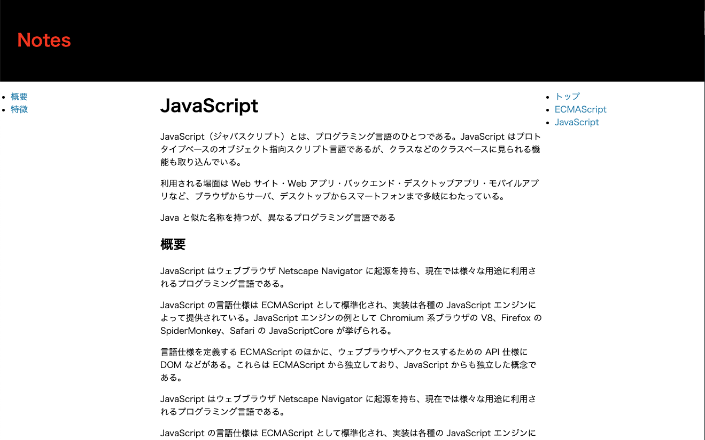
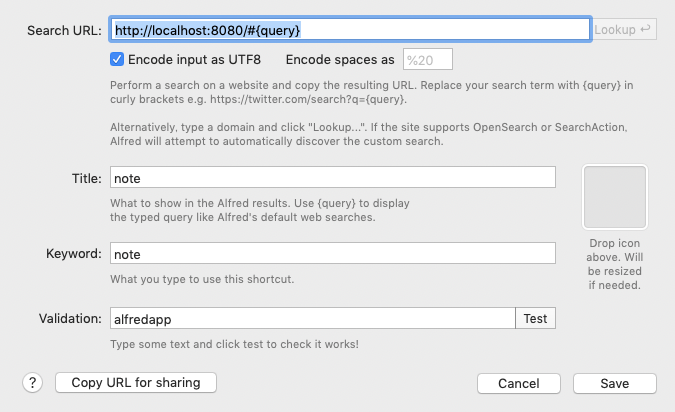

## なにができる？

テキストエディタで作成・編集した`.md`のブラウザプレビューとページリンクの生成



## 実装構成

- Redux toolkit を試すために実装したもの
- Node 環境で実行するアプリを TS + webpack でバンドルしている（`webpack.config-watcher.js`）

## 利用イメージ

- alfred で`open ecmascrip.md`して気軽にテキストエディタでメモ
- alfred に`note`コマンドを登録しておき、`note ecmascrip`で気軽にブラウザプレビュー
  - forever で常駐させた http server 管理下にアプリを配置しておくと便利



## 機能

- `public/notes/*.md`のマークダウンファイルを、location hash で指定すると（`ecmascrip.md`なら`#ecmascrip`）、動的に`*.md`を取得し html 変換して画面に表示する SPA
- heading タグからの TOC の生成
- location hash リンク付きの記事リストの生成

## アプリの種類

- notes
  - 動的に md ファイルを html に変換してページとして表示する。
- watcher
  - md ファイルの変更を監視して、変更内容をページリスト（`public/notes/_notes.md`）に反映する。
- server
  - live-server を実行してるだけ（なので特に無くても問題なし）。簡易動作確認用。

## ビルドと実行

```bash
npm run build
npm run start:watcher
```

```
# http server
npm run start:server
```

## 開発時のビルド

```
npm run dev:notes
npm run dev:watcher
```

ソースコードの変更を監視して自動的にビルドする。
